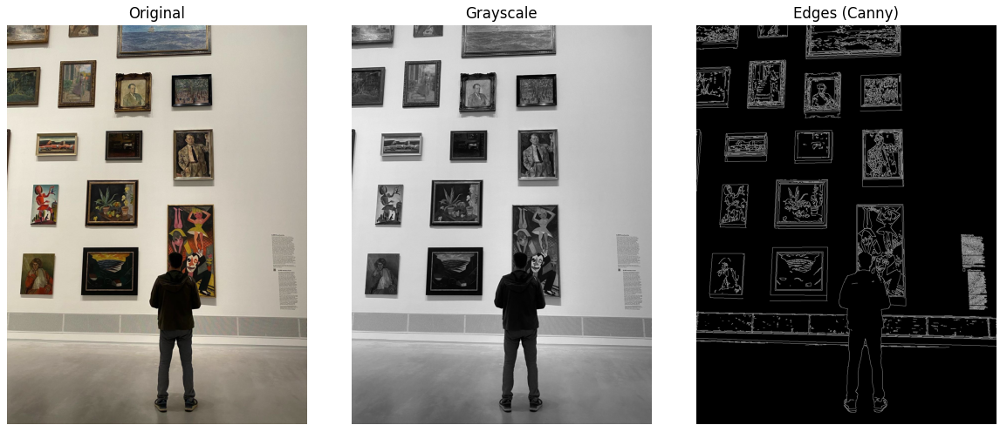

# image-processing-tool
A minimal image processing project to demonstrate
- Reading an image
- Converting to greyscale
- Detecting edges using Canny

## Libraries used
- OpenCV
- NumPy
- Matplotlib

## How to run
- clone the repo
- (optinal) create and activate a virtual environment
- install dependencies

```python 
pip install -r requirements.txt
```
- open 'image_processing_tool.ipynb' in VS Code or jupyter
- run the code

following picture should be the result (own picture)

